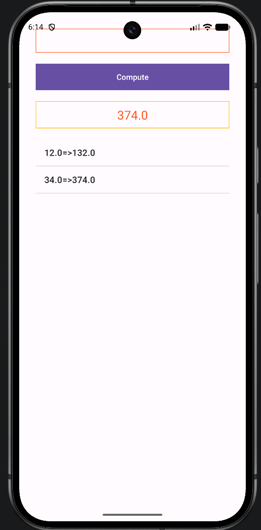

#  TP01 CALCULATOR -  : Prof MAWANE

Ce TP consiste à modifier le projet de base android (Empty view Activity) pour implémenter un calculateur.

## Modification et intégration du code sources

| Etape | Commentaire |
|---|---|
| 1 | Créez un nouveau projet Android dans Android Studio|
| 2 | Remplacez le contenu de res/layout/activity_main.xml par votre LinearLayout|
| 3 | Ajoutez edit_text_style.xml et text_view_style.xml dans res/drawable/
| 4 | Déclarez les couleurs dans res/values/colors.xml|
| 5 | Placez le code Java dans MainActivity après setContentView(...), à l'intérieur de onCreate|
| 6 | Exécutez l'application sur un émulateur ou un appareil Android|

## Prerequis communs

• L’objectif étant de créer une simple application mobile Android qui permet de :
• Saisir un nombre représentant un montant en Euro dans un composant de type
« EditText »
• Convertir le montant saisi en DH en le multipliant par le taux de change
• Afficher le résultat dans un champ de type TextView.
• Ajouter l’historiques des conversions dans un ListView

- Installer Android Studio (V)

<h1>  </h1> 
